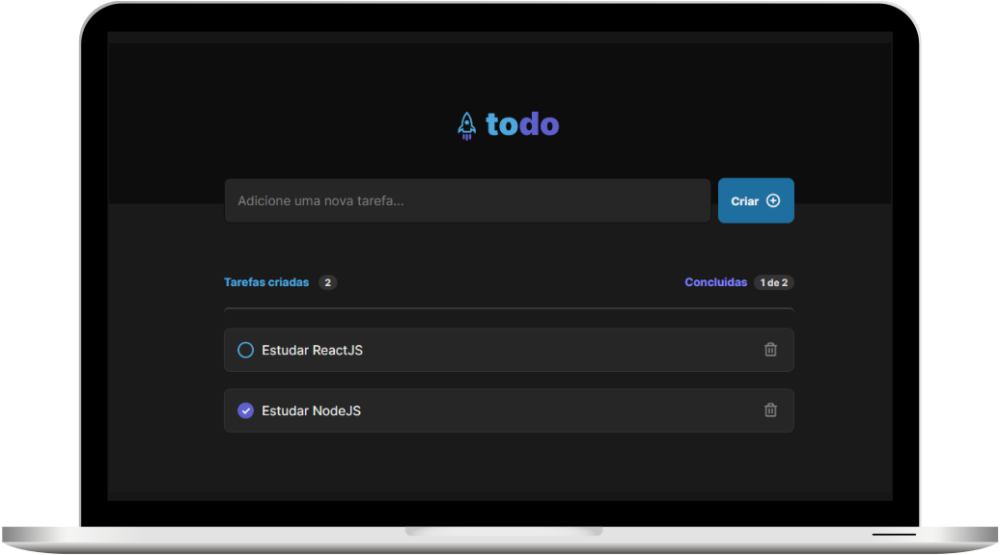

# Todo App

<h1 align="center">
    
</h1>

# Sobre

Aplicação Todo para estudos de ReactJS

Link: https://ignite-reactjs-desafio-1.vercel.app/

### Funcionalidades

- [x] Adicionar uma nova tarefa
- [x] Marcar e desmarcar uma tarefa como concluída
- [x] Remover uma tarefa da listagem
- [x] Mostrar o progresso de conclusão das tarefas
- [x] Persistir os dados no LocalStorage
